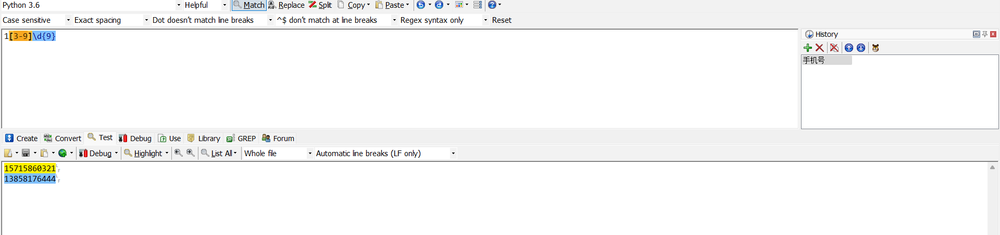

# 正则表达式练习

## P1. 手机号

- 第 1 位固定为数字 1；
- 第 2 位可能是 3，4，5，6，7，8，9；
- 第 3 位到第 11 位我们认为可能是 0-9 任意数字。

code: [regex-phone](../code/regexp/02-phone.py)



## P2. 贪婪模式和非贪婪模式

code: [mode](../code/regexp/03-mode.py)

## P3. 取出文章中的单词，双引号下算一个

code: [get-word](../code/regexp/04-get-word.py)

## P5. 去除字符串中的重复单词

code:  [duplicate-str](../code/regexp/01-duplicate-str.py)

code: [replace-duplicate-str](../code/regexp/05-replace-duplicate-str.py)

## P6. 6位密码，但不能有两个连续的数字出现

code: [valid-password](../code/regexp/06-valid-password.py)

## P7. 匹配正数、负数、小数

code: [match-num](../code/regexp/07-match-num.py)

## P8. 身份证

code: [idcard](../code/regexp/08-idcard.py)

## P9. 邮政编码

code: [zip-code](../code/regexp/09-zip-code.py)

## P10. QQ

code: [qq](../code/regexp/10-qq.py)

## P11. 中文

code: [chinese](../code/regexp/11-chinese.py)

## P12. IP地址

code: [chinese](../code/regexp/12-ip.py)

## P13. 日期和时间

code: [datetime](../code/regexp/13-datetime.py)

## P14.邮箱

code: [email](../code/regexp/14-email.py)

P15.直接统计文章单词频次TOP10

```regexp
grep -Po '\w+' article.txt | sort | uniq -c | sort -nr | head -10
```